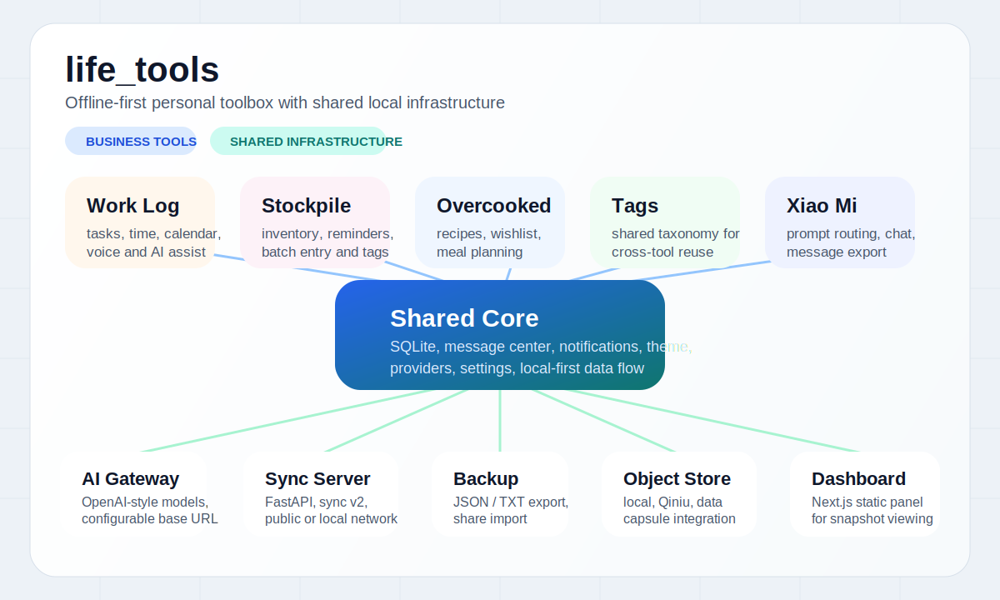
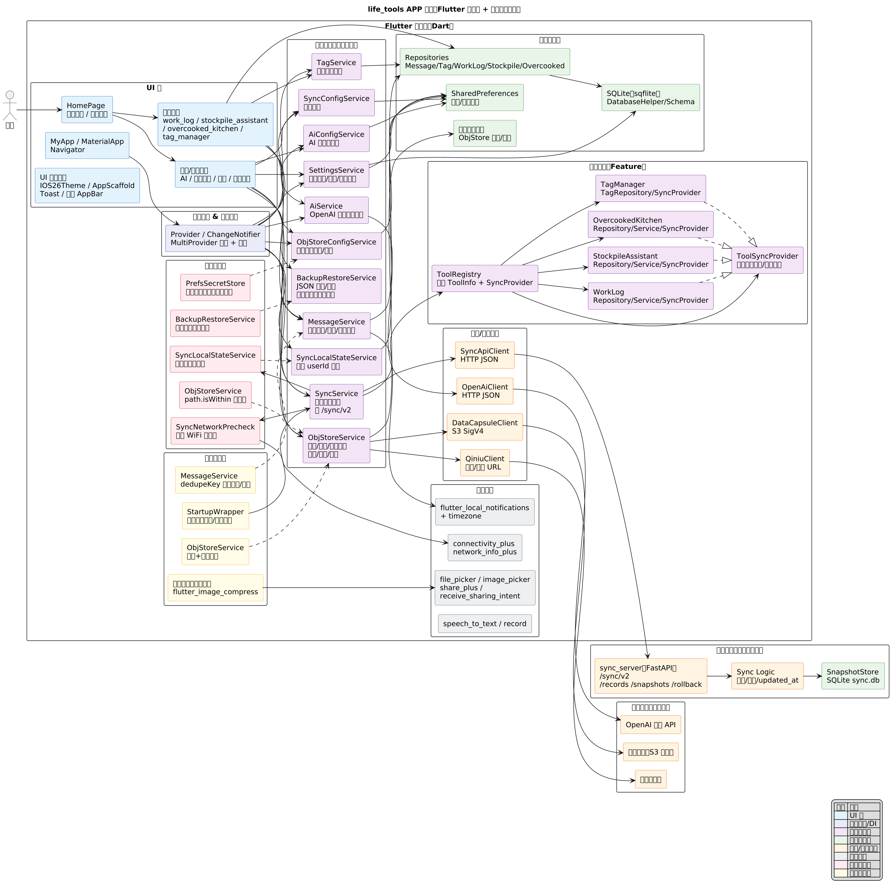
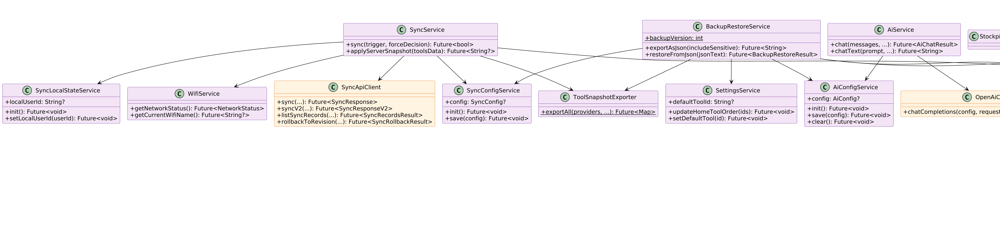
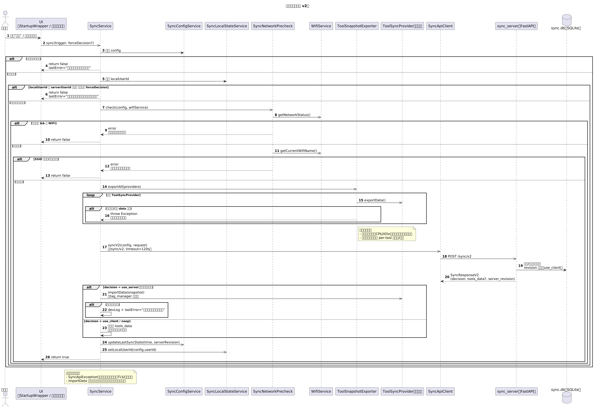
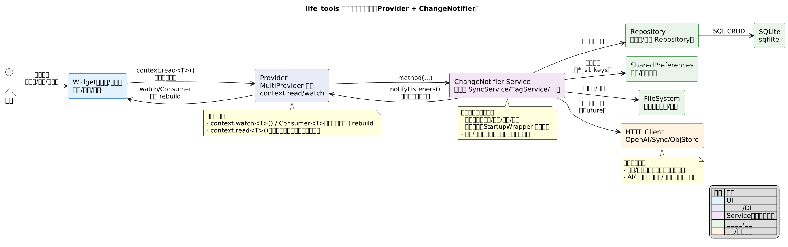

# life_tools

<div align="center">

一个面向个人生活管理的 Flutter 工具箱应用，围绕离线优先、本地存储、可选 AI 与可选自建同步展开。

[](https://flutter.dev/)
[](https://dart.dev/)
[](https://fastapi.tiangolo.com/)
[](https://nextjs.org/)
[](#)

</div>

<p align="center">
  <a href="#overview">项目简介</a> ·
  <a href="#module-overview">模块总览</a> ·
  <a href="#architecture-preview">架构预览</a> ·
  <a href="#feature-matrix">功能矩阵</a> ·
  <a href="#project-calendar">项目日历</a> ·
  <a href="#quick-start">快速开始</a> ·
  <a href="#development-workflow">开发流程</a> ·
  <a href="#documents">相关文档</a>
</p>

<a id="overview"></a>
## 项目简介

`life_tools` 的目标不是做一个“大而全”的超级 App，而是把高频生活场景拆成一组可独立演进的小工具，并通过统一的本地数据库、标签体系、消息中心、备份恢复和同步能力把它们串起来。

当前仓库由三部分组成：

- Flutter 主应用：日常工具与核心能力的实现主体
- `backend/sync_server`：基于 FastAPI 的可选自建同步后端
- `dashboard/`：基于 Next.js 的静态管理面板

当前代码状态（截至 2026-05-31）：

- 客户端版本：`1.0.0+2`
- 已注册工具：工作记录、囤货助手、胡闹厨房、小蜜、标签管理
- 同步主路径：仅保留 `POST /sync/v2`
- 同步快照范围：4 个业务/公共工具 + `app_config`
- 管理面板范围：用户、快照、工具数据、应用配置、同步记录、工作记录工时视图

<a id="module-overview"></a>
## 模块总览

<p align="center">
  
</p>

项目采用“业务工具层 + 共享基础设施层”的组织方式：上层保持每个工具独立演进，下层复用统一的数据库、同步、备份、消息、对象存储与 AI 能力，减少跨模块重复实现。

<details>
<summary>后续界面截图建议位</summary>

| 展示位 | 推荐内容 | 建议素材路径 |
| --- | --- | --- |
| 首页总览 | 工具入口卡片、消息入口、全局导航 | `docs/readme/screenshots/home.png` |
| 工作记录 | 任务列表、工时记录、日历视图 | `docs/readme/screenshots/work-log.png` |
| 囤货助手 | 库存列表、临期提醒、AI 批量录入 | `docs/readme/screenshots/stockpile.png` |
| 胡闹厨房 | 食谱详情、愿望单、计划页 | `docs/readme/screenshots/overcooked.png` |
| 小蜜 | 对话页、提示词触发、联动结果 | `docs/readme/screenshots/xiao-mi.png` |
| Dashboard | 用户视图、快照概览、工具摘要 | `docs/readme/screenshots/dashboard.png` |

</details>

## 核心亮点

- 离线优先：默认数据落在本地 SQLite，不依赖云账号也能完整使用
- 工具化设计：每个场景独立成工具页，避免一个首页承载过多复杂交互
- 统一基础设施：标签、消息、备份恢复、对象存储、AI、同步均为跨工具能力
- 多端覆盖：支持 Android、iOS、Web、Linux、macOS、Windows
- 可选联网：AI、对象存储、自建同步都按需启用，不强绑定外部服务
- 工程化配套：包含自动化校验脚本、Android APK workflow、架构文档与时序图

<a id="architecture-preview"></a>
## 架构预览

<table>
  <tr>
    <td width="50%">
      <a href="docs/architecture/APP_ARCHITECTURE.md">
        
      </a>
    </td>
    <td width="50%">
      <a href="docs/architecture/PUBLIC_INTERFACES.md">
        
      </a>
    </td>
  </tr>
  <tr>
    <td align="center"><strong>应用分层与模块边界</strong></td>
    <td align="center"><strong>公共接口与服务关系</strong></td>
  </tr>
  <tr>
    <td width="50%">
      <a href="docs/sync_protocol_v2.md">
        
      </a>
    </td>
    <td width="50%">
      <a href="docs/architecture/README.md">
        
      </a>
    </td>
  </tr>
  <tr>
    <td align="center"><strong>同步协议关键时序</strong></td>
    <td align="center"><strong>状态管理与数据流</strong></td>
  </tr>
</table>

如果你要继续深挖实现细节，建议从 [架构文档入口](docs/architecture/README.md) 开始。当前文档已经按最新代码同步了 Provider 注入、工具注册、`sync/v2` 主路径、Dashboard API 和应用配置同步。

<a id="feature-matrix"></a>
## 功能矩阵

| 模块 | 说明 | 当前能力 |
| --- | --- | --- |
| 工作记录 `Work Log` | 把任务、工时、操作记录串成可回溯的数据链路 | 任务管理、任务排序、工时记录、工时查询、日历视图、语音输入、AI 整理、操作日志 |
| 囤货助手 `Stockpile Assistant` | 管理库存、消耗与到期提醒 | 物品管理、消耗记录、临期提醒、AI 批量录入、标签筛选 |
| 胡闹厨房 `Overcooked Kitchen` | 面向食谱和做饭节奏的轻量工具 | 食谱、愿望单、抽卡选餐、餐食计划、提醒与统计 |
| 标签管理 `Tag Manager` | 全局标签能力，供多工具复用 | 分类、重命名、排序、删除、跨工具关联 |
| 小蜜 `Xiao Mi` | 基于预置提示词和预选路由的 AI 对话工具 | 流式对话、思考过程查看、消息导出、历史会话批量删除、工作总结、任务查询、工时查询、胡闹厨房本地查询 |

## 跨工具基础能力

- AI 能力：兼容 OpenAI 风格接口，支持配置 Base URL、模型与 Key，并记录最近调用用量与耗时
- 数据同步：客户端优先使用 `POST /sync/v2`，支持公网和局域网 WiFi 场景
- 备份恢复：支持 JSON / TXT 导出，支持分享接收导入
- 对象存储：支持本地对象存储，也可接入七牛云或数据胶囊
- 消息中心：汇总提醒和事件，支持过期消息清理
- 本地通知：在移动端为库存、愿望单等场景推送提醒
- 语音输入：支持语音转文字与录音，供工作记录等场景使用
- 国际化：内置中英文完整支持
- 统一主题：项目内置 iOS 26 风格主题与一套自定义基础组件
- Dashboard：可静态部署，用于查看用户快照、编辑工具数据、回退同步快照和分析工作记录工时

## 系统结构

```text
life_tools
├─ lib/                     # Flutter 主应用
│  ├─ core/                 # AI、同步、备份、消息、对象存储、数据库、主题、语音
│  ├─ tools/                # 各业务工具模块
│  ├─ pages/                # 首页与设置等公共页面
│  ├─ l10n/                 # 国际化（中英文）
│  └─ main.dart             # 应用入口与服务初始化
├─ test/                    # Flutter 单元/组件/页面/设计约束测试
├─ backend/sync_server/     # FastAPI 同步后端
├─ dashboard/               # Next.js 静态管理面板
├─ docs/architecture/       # 架构图、时序图、ADR 与接口文档
├─ examples/                # 代码规范与示例（AI、消息、对象存储、标签、UI）
├─ design-system/           # 设计系统文档
└─ scripts/                 # 开发、校验、提交流程脚本
```

更详细的架构说明见：

- [docs/architecture/README.md](docs/architecture/README.md)
- [docs/architecture/APP_ARCHITECTURE.md](docs/architecture/APP_ARCHITECTURE.md)
- [docs/architecture/PUBLIC_INTERFACES.md](docs/architecture/PUBLIC_INTERFACES.md)

## 技术栈

### 客户端

- Flutter / Dart 3.10+
- SQLite：`sqflite`、`sqflite_common_ffi`
- 状态管理：`provider`
- 本地存储：`shared_preferences`
- 本地通知：`flutter_local_notifications`
- 语音与媒体：`speech_to_text`、`record`、`image_picker`
- 分享与文件：`share_plus`、`receive_sharing_intent`、`file_picker`、`file_saver`
- 网络：`connectivity_plus`、`network_info_plus`
- 权限：`permission_handler`
- 国际化：`intl`
- Markdown：`flutter_markdown`
- 滑动操作：`flutter_slidable`

### 服务端与面板

- Sync Server：Python + FastAPI + SQLite
- Dashboard：Next.js 15 + React 19 + TypeScript + Tailwind CSS + Vitest

<a id="project-calendar"></a>
## 项目日历

完整日历见 [docs/version-record.md](docs/version-record.md)。下表只列当前功能形态的关键节点，日期来自 git 提交历史。

| 日期 | 新增或完成的主要能力 |
| --- | --- |
| 2026-01-10 | Flutter 基础工程、iOS 26 风格主题、工作记录核心功能 |
| 2026-01-11 ~ 2026-01-15 | OpenAI 兼容 AI 配置、同步与备份雏形、中文本地化、TXT 导入导出、标签系统、任务筛选与分页 |
| 2026-01-16 ~ 2026-01-22 | 囤货助手、消息中心、本地通知、临期/补货提醒、对象存储、本地/七牛、工具标签分类、胡闹厨房 |
| 2026-01-23 ~ 2026-01-29 | 胡闹厨房图片缓存与查看、菜谱评分、数据胶囊对象存储、通用标签选择器、首页工具排序与工具管理 |
| 2026-02-03 ~ 2026-02-05 | FastAPI 同步后端、同步记录/差异/回退、`app_config` 同步、启动自动同步、用户不匹配保护 |
| 2026-02-07 ~ 2026-02-12 | 工作记录 AI 总结、胡闹厨房 AI 菜谱、全局暗黑模式、AI 调用历史及其同步/备份 |
| 2026-02-13 ~ 2026-02-25 | 三段式提交流程、关于页构建信息、全部消息页滑动操作、客户端性能优化 |
| 2026-03-02 ~ 2026-03-06 | 小蜜 AI 聊天、流式输出、预选路由、special_call、消息导出、胡闹厨房本地数据注入、Next.js Dashboard 初版 |
| 2026-03-08 ~ 2026-03-18 | Dashboard 工作记录工时树/画布、快照编辑、静态部署、版本信息、同步回流兼容 |
| 2026-04-12 ~ 2026-04-22 | Dashboard 工时画布筛选与悬浮详情、小蜜任务/工时查询增强、同步统一收口 v2、工时柱状图 |
| 2026-05-06 ~ 2026-05-09 | 新装应用同步 AI 配置修复、小蜜 AI 用量与耗时展示 |

<a id="quick-start"></a>
## 快速开始

### 1. Flutter 主应用

```bash
flutter pub get
flutter run
```

常用校验命令：

```bash
flutter analyze
bash scripts/test_flutter.sh
```

格式检查与修复：

```bash
dart format --output=none --set-exit-if-changed .
dart format .
```

### 2. 同步后端

```bash
cd backend/sync_server
python3 -m venv .venv
.venv/bin/pip install -r requirements-dev.txt
.venv/bin/uvicorn sync_server.main:app --reload --host 0.0.0.0 --port 8080
```

默认数据库位置：

```bash
backend/sync_server/data/sync.db
```

也可以通过环境变量覆盖：

```bash
export SYNC_SERVER_DB_PATH="/tmp/life_tools_sync.db"
```

### 3. Dashboard

```bash
cd dashboard
npm install
npm run build
```

构建产物默认输出到：

```bash
dashboard/dist
```

若要指定独立后端地址，可在构建时注入：

```bash
NEXT_PUBLIC_LIFE_TOOLS_DASHBOARD_API_BASE_URL=https://your-api.example.com npm run build
```

## 配置说明

### AI

- 默认关闭
- 需要在应用内自行配置 Base URL、模型与 API Key
- 项目按 OpenAI 风格接口组织调用

### 同步

- 同步服务端地址由客户端配置
- 客户端支持公网地址和局域网地址
- WiFi 场景支持白名单，降低误同步概率

### 对象存储

- 可使用本地对象存储
- 可按需接入七牛云
- 可按需接入数据胶囊，固定为 HTTPS + 路径风格 + 私有空间

## 数据与隐私

- 默认所有业务数据保存在本地 SQLite
- 外部能力全部为可选项，不配置也不影响核心离线能力
- 备份恢复默认可导出敏感配置，便于跨设备迁移；分享前应确认接收方可信
- 外部服务优先按 HTTPS 使用；本地或局域网同步场景可显式使用 HTTP

<a id="development-workflow"></a>
## 开发流程

仓库内置了三段式提交流程脚本：

```bash
bash scripts/pre-push.sh
bash scripts/exec-push.sh --stage-all --push --summary "你的改动摘要"
bash scripts/post-push.sh
```

其中：

- Flutter 改动默认执行 `flutter pub get`、`flutter analyze`、`flutter test`
- 仅后端改动时执行后端测试
- 仅文档改动时跳过测试

Android APK 构建 workflow 见：

- [`.github/workflows/build-apk.yml`](.github/workflows/build-apk.yml)

## 测试与质量

- Flutter：`flutter analyze`、`flutter test`
- Backend：`cd backend/sync_server && .venv/bin/pytest`
- Dashboard：`cd dashboard && npm test`
- 设计约束：`test/design/` 下包含颜色、按钮、排版等自动化约束检查

Linux 下若 Flutter 测试遇到 `libsqlite3.so` 缺失，可执行：

```bash
ln -sf /usr/lib/x86_64-linux-gnu/libsqlite3.so.0 /tmp/libsqlite3.so
LD_LIBRARY_PATH=/tmp flutter test
```

<a id="documents"></a>
## 相关文档

- [架构总览](docs/architecture/APP_ARCHITECTURE.md)
- [公共接口与调用链](docs/architecture/PUBLIC_INTERFACES.md)
- [同步协议 v2](docs/sync_protocol_v2.md)
- [小蜜预选路由特殊调用](docs/xiao_mi_pre_route_special_calls.md)
- [项目日历与版本记录](docs/version-record.md)
- [架构文档入口](docs/architecture/README.md)
- [Android 签名说明](docs/android_release_signing.md)
- [性能优化记录](docs/client_performance_optimization_summary_2026-02-25.md)
- [Dashboard 说明](dashboard/README.md)
- [Sync Server 说明](backend/sync_server/README.md)

## 仓库地址

- GitHub: https://github.com/sprogFall/life_tools
